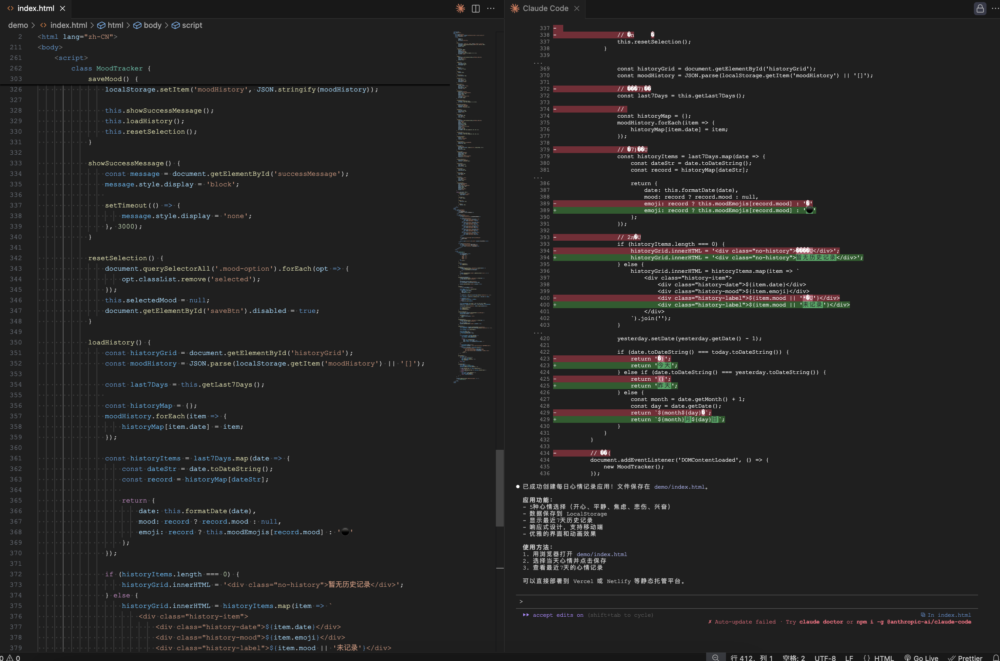

## 第一节课：Vibe Coding 基础认知

1. 描述下 MVP 场景描述
* 开发一个"记录每日心情的web应用"

  - 用户选择心情（如“开心”、“平静”、“焦虑”）并保存，可查看最近7天记录
      核心功能
  - 选择心情，点击保存。
  - 查看7天历史记录。
      技术栈
  - 前端：HTML + CSS + JavaScript，数据存LocalStorage
  - 无后端，静态部署。

2. 工作流设计思路
  - 明确需求：心情选择、保存、历史记录。
  - AI辅助：用AI生成HTML/CSS/JS代码，提示：“记录每日心情的web应用，用LocalStorage存数据。”
  - 开发
    - 建页面：下拉菜单、保存按钮、历史区域。
    - 实现保存：心情+时间戳存LocalStorage。
    - 显示历史：读取并展示7天记录。
  - 测试：本地运行，检查功能，收集反馈。
  - 部署：用Vercel或Netlify上线。
  - 工具：AI生成代码、GitHub版本控制、Chrome调试。
    
3. AI生成的代码样板截图或链接

