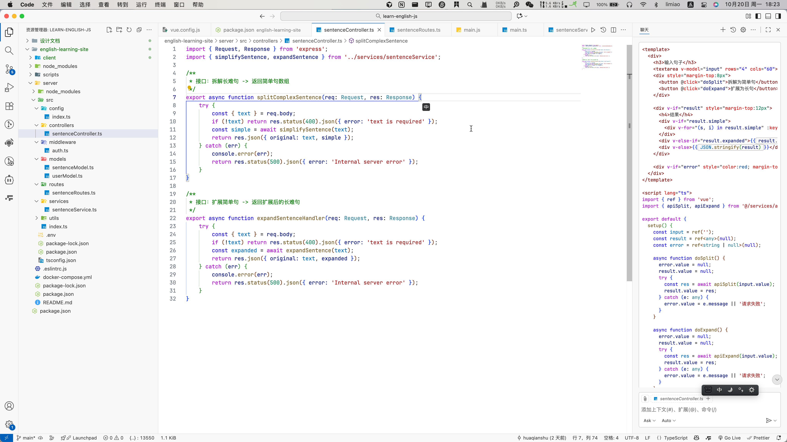

## 第一节课：Vibe Coding 基础认知

1. 描述下 MVP 场景描述

   假设现在我有一个想法，想要做一个通过 ai 练习英语口语的网站。

   1. 先明确这个项目最核心的功能：通过 ai 练习英语口语
   2. 利用 ai 工具实现核心功能的网站
   3. 把这个网站发送给一部分愿意试用的用户，体验这个功能
   4. 收集用户使用反馈，根据反馈再做调整

2. 工作流设计思路

   1. 迭代优化：

      设计工作流最重要的一点是要明解 ai 的理解是正确的，所以在设计工作流的时候一定要反复地跟 ai 确定，ai 的理解与我们表达的时否一致，当确定一致之后，再开始具体的工作。

   2. 明确上下文：

      在 ai 工作的时候，提供明确且具体的上下文也是一个重要的环节，在设计工作流的时候，要不断地向 ai 回顾之前的工作内容，以及要明确当下的工作的上下文是什么。

   3. 拆分任务：

      ai 对于处理复杂的任务的能力比弱，处理简单的任务的能力比较强。所以在设计工作流的时候，尽量把一个复杂的任务，拆解成一个个小的简单的任务，拆解之后也更易于 ai 的理解，更容易达成最终目标。

   

3. AI生成的代码样板截图或链接

   

